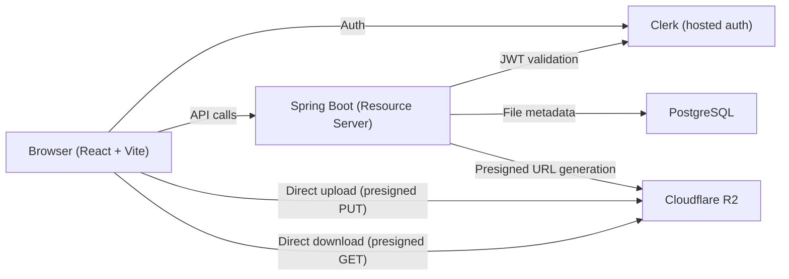
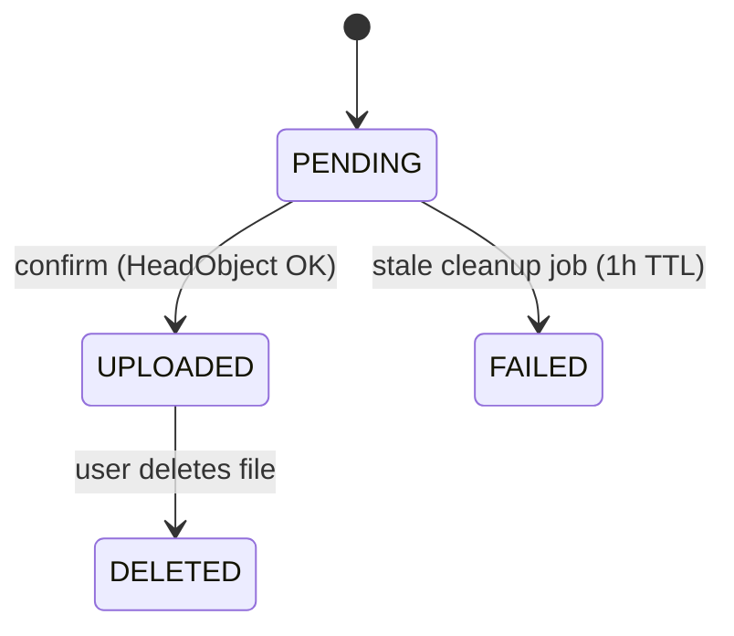
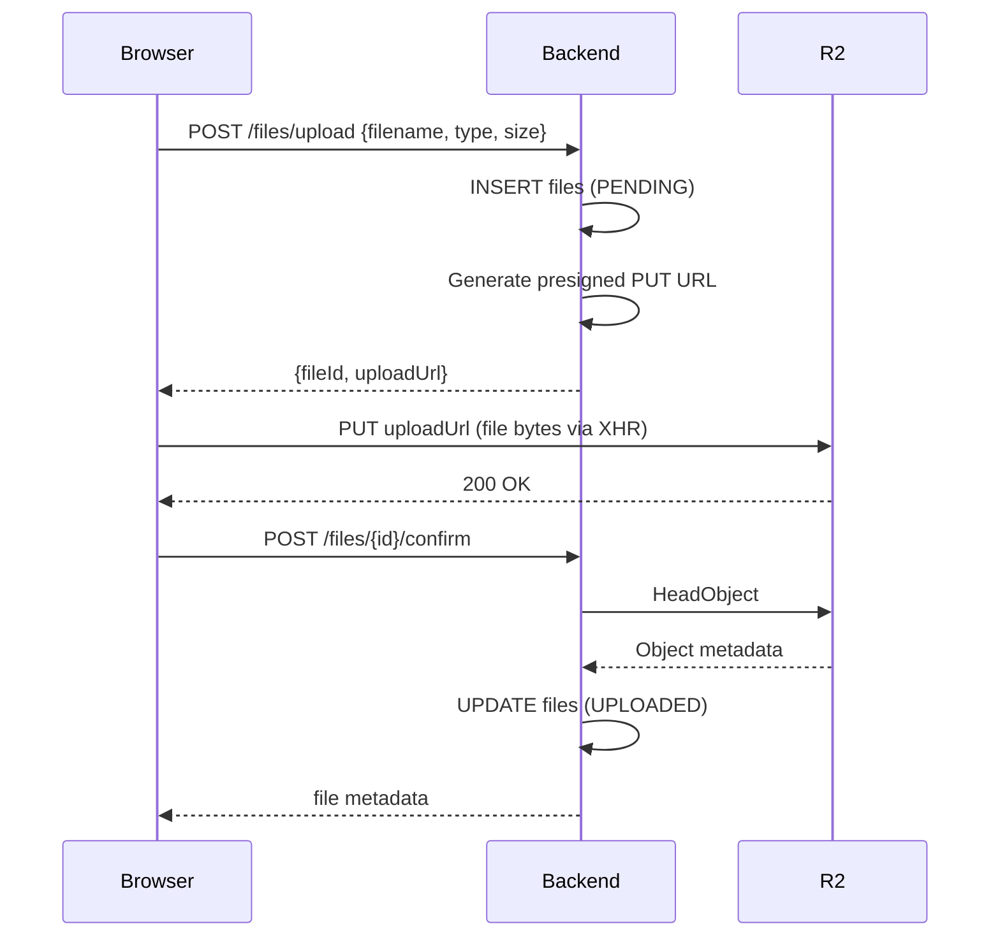

# pocket-drive — Design Reference

## Architecture

File bytes never flow through the backend. The backend is a metadata and authorization layer that issues short-lived presigned URLs. The browser talks directly to R2 for all data transfer.

---

## Data Model

| Column | Type | Notes |
|--------|------|-------|
| `id` | UUID PK | |
| `owner_id` | TEXT | Clerk user ID (`sub` claim) |
| `object_key` | TEXT UNIQUE | `{owner_id}/{uuid}/{filename}` |
| `original_name` | TEXT | |
| `content_type` | TEXT | |
| `size_bytes` | BIGINT | |
| `status` | TEXT | `PENDING` → `UPLOADED` → `DELETED` / `FAILED` |
| `created_at` | TIMESTAMPTZ | |
| `updated_at` | TIMESTAMPTZ | |

---

## API

Base path: `/api/v1`. All endpoints require `Authorization: Bearer <clerk_jwt>`.

| Method | Path | Description |
|--------|------|-------------|
| `POST` | `/files/upload` | Initiate upload — returns presigned PUT URL |
| `POST` | `/files/{id}/confirm` | Confirm upload — HeadObject check, flip to UPLOADED |
| `GET` | `/files` | List files (UPLOADED only, paginated) |
| `GET` | `/files/{id}/download` | Get presigned GET URL |
| `DELETE` | `/files/{id}` | Soft-delete — removes R2 object, sets DELETED |

---

## Upload Flow

Upload validation: 100 MB max, allowlist of content types (`application/pdf`, `image/*`, `text/plain`, `application/zip`). The presigned PUT URL locks `contentType` and `contentLength` — R2 rejects mismatches.

---

## Auth

Clerk issues JWTs. Spring Security validates them via JWKS auto-discovery (`issuer-uri`). The `sub` claim is the `owner_id` on every file row. All file operations enforce ownership — no cross-user access.

---

## R2 CORS

Direct browser uploads require CORS on the R2 bucket. See `cors.json` at repo root for the required rules (update `AllowedOrigins` for production).
