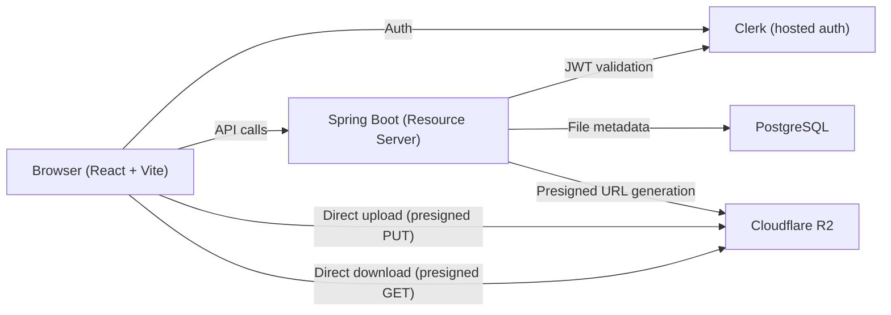
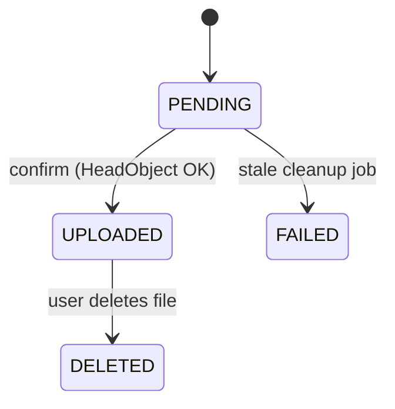
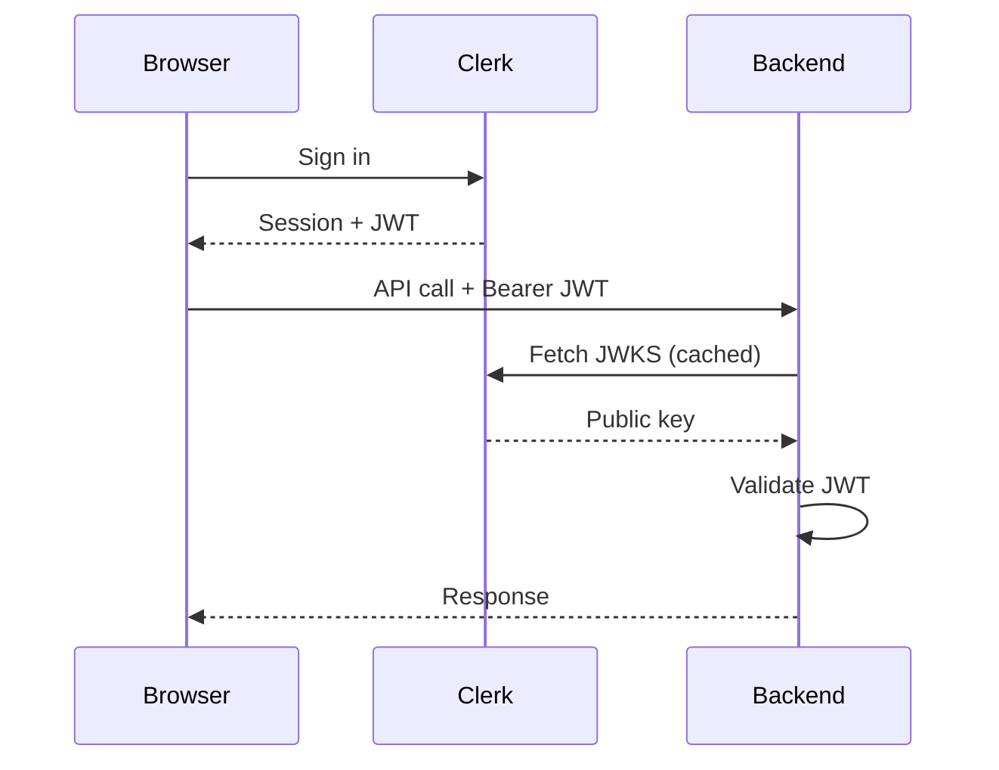
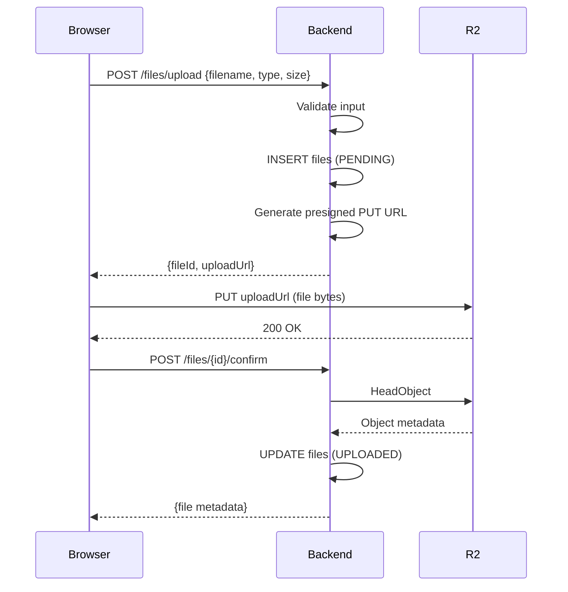

# Pocket Drive — System Design

Personal cloud drive focused on learning production object-storage patterns.

---

## 1. Architecture Overview



**Key principle:** File bytes never flow through the backend. The backend is a metadata + authorization layer that hands out short-lived presigned URLs. The browser talks directly to R2 for all data transfer.

---

## 2. Tech Stack

| Layer | Tech | Why |
|-------|------|-----|
| Backend | Spring Boot 3.x (Java 21) | Core learning target |
| Auth provider | Clerk | Hosted auth, JWT issuer, React SDK |
| Auth integration | spring-boot-starter-oauth2-resource-server | Validates Clerk JWTs via JWKS endpoint |
| Database | PostgreSQL 16 | File metadata, ownership |
| Migrations | Flyway | Versioned, repeatable schema management |
| Object storage | Cloudflare R2 | S3-compatible, no egress fees |
| Storage SDK | AWS SDK for Java v2 (`software.amazon.awssdk:s3`) | R2 is S3-compatible; use `S3Presigner` for URLs |
| Frontend | React 18 + Vite + TypeScript | Lightweight, Clerk React SDK makes auth trivial |
| HTTP client | Fetch API (browser native) | No need for axios for this scope |
| Styling | Tailwind CSS | Fast, no design system to learn |
| Testing | JUnit 5 + Testcontainers + MockMvc | Real PostgreSQL in tests, no H2 drift |
| Dev tooling | Wrangler CLI | Inspect R2 buckets independently of the app |

---

## 3. Data Model

### 3.1 `files` table

```sql
CREATE TABLE files (
    id            UUID PRIMARY KEY DEFAULT gen_random_uuid(),
    owner_id      TEXT        NOT NULL,  -- Clerk user ID (sub claim)
    object_key    TEXT        NOT NULL UNIQUE,
    original_name TEXT        NOT NULL,
    content_type  TEXT        NOT NULL,
    size_bytes    BIGINT      NOT NULL,
    status        TEXT        NOT NULL DEFAULT 'PENDING',
    created_at    TIMESTAMPTZ NOT NULL DEFAULT now(),
    updated_at    TIMESTAMPTZ NOT NULL DEFAULT now()
);

CREATE INDEX idx_files_owner_status ON files (owner_id, status);
CREATE INDEX idx_files_status_created ON files (status, created_at);  -- for stale cleanup
```

### 3.2 File Status Lifecycle



| Status | Meaning |
|--------|---------|
| `PENDING` | Metadata created, presigned upload URL issued, upload not yet confirmed |
| `UPLOADED` | Client confirmed upload, backend verified object exists in R2 via `HeadObject` |
| `FAILED` | Upload was never confirmed within the expiry window (set by cleanup job) |
| `DELETED` | Soft-deleted — R2 object removed, metadata retained for audit trail |

**Why soft-delete:** Keeps an audit trail and lets you debug storage issues. The `DELETED` row costs nothing. If you want hard-delete later, add a reaper job that purges `DELETED` rows older than 30 days.

### 3.3 Object Key Strategy

```
{owner_id}/{uuid}/{original_filename}
```

Example: `user_2xKj9.../a1b2c3d4.../quarterly-report.pdf`

- `owner_id` prefix: easy to browse per-user in Wrangler
- `uuid` segment: prevents collisions even if the same user uploads the same filename twice
- `original_filename` suffix: useful when inspecting objects in R2 directly (human-readable)

---

## 4. API Design

Base path: `/api/v1`

All endpoints require `Authorization: Bearer <clerk_jwt>`. The backend extracts `sub` from the validated JWT as the owner identity.

### 4.1 Initiate Upload

```
POST /api/v1/files/upload
```

**Request:**
```json
{
  "filename": "report.pdf",
  "contentType": "application/pdf",
  "sizeBytes": 2048576
}
```

**Response (201):**
```json
{
  "fileId": "uuid",
  "objectKey": "user_abc/uuid/report.pdf",
  "uploadUrl": "https://r2-account.r2.cloudflarestorage.com/bucket/...?X-Amz-Signature=...",
  "expiresIn": 900
}
```

**Backend logic:**
1. Validate content type against allowlist
2. Validate size against max limit
3. Generate object key
4. Create `files` row with status `PENDING`
5. Generate presigned PUT URL (15 min expiry)
6. Return URL + file metadata

### 4.2 Confirm Upload

```
POST /api/v1/files/{fileId}/confirm
```

**Response (200):**
```json
{
  "fileId": "uuid",
  "status": "UPLOADED",
  "originalName": "report.pdf",
  "sizeBytes": 2048576,
  "createdAt": "2026-04-12T..."
}
```

**Backend logic:**
1. Load file record, verify `owner_id` matches caller
2. Reject if status is not `PENDING` (idempotency: if already `UPLOADED`, return 200; if `FAILED`/`DELETED`, return 409)
3. Call `HeadObject` on R2 to verify the object actually exists and check its size
4. Update status to `UPLOADED`, update `updated_at`

### 4.3 List Files

```
GET /api/v1/files?page=0&size=20
```

**Response (200):**
```json
{
  "content": [
    {
      "fileId": "uuid",
      "originalName": "report.pdf",
      "contentType": "application/pdf",
      "sizeBytes": 2048576,
      "status": "UPLOADED",
      "createdAt": "2026-04-12T..."
    }
  ],
  "page": 0,
  "size": 20,
  "totalElements": 1
}
```

**Backend logic:**
1. Query `files` where `owner_id = caller` and `status = UPLOADED`
2. Return paginated results, sorted by `created_at DESC`

### 4.4 Get Download URL

```
GET /api/v1/files/{fileId}/download
```

**Response (200):**
```json
{
  "downloadUrl": "https://r2-account.r2.cloudflarestorage.com/bucket/...?X-Amz-Signature=...",
  "expiresIn": 300
}
```

**Backend logic:**
1. Load file, verify ownership and status is `UPLOADED`
2. Generate presigned GET URL (5 min expiry)
3. Set `Content-Disposition: attachment; filename="original_name"` in the presigned URL params

### 4.5 Delete File

```
DELETE /api/v1/files/{fileId}
```

**Response (204):** No content.

**Backend logic:**
1. Load file, verify ownership
2. Delete object from R2 (`DeleteObject`)
3. Update status to `DELETED`, update `updated_at`
4. If R2 delete fails, log the error but still mark as `DELETED` — the cleanup job will retry orphaned objects

---

## 5. Auth Design

### 5.1 Clerk JWT Flow



### 5.2 Spring Security Config

```yaml
# application.yml
spring:
  security:
    oauth2:
      resourceserver:
        jwt:
          issuer-uri: https://<your-clerk-instance>.clerk.accounts.dev
          # Spring auto-discovers JWKS endpoint from .well-known/openid-configuration
```

The `issuer-uri` tells Spring to fetch the JWKS endpoint automatically. Spring caches the keys.

### 5.3 Extracting User Identity

Write a small utility or `@AuthenticationPrincipal` resolver that pulls the `sub` claim from the validated `Jwt` token. This is the Clerk user ID and becomes the `owner_id` everywhere.

```java
// In controller method parameters:
@AuthenticationPrincipal Jwt jwt

String ownerId = jwt.getSubject(); // Clerk user ID
```

### 5.4 Security Rules

- All `/api/v1/**` endpoints require a valid JWT
- Every file operation checks `file.ownerId == jwt.subject` — no exceptions
- No public endpoints except health check
- CORS restricted to your frontend origin

---

## 6. R2 / S3 Configuration

### 6.1 Backend S3 Client Config

```yaml
# application.yml
r2:
  endpoint: https://<account-id>.r2.cloudflarestorage.com
  bucket: pocket-drive
  region: auto
  access-key: ${R2_ACCESS_KEY}
  secret-key: ${R2_SECRET_KEY}
  presigned-upload-expiry: 900    # 15 minutes
  presigned-download-expiry: 300  # 5 minutes
```

Create a `@Configuration` class that builds the `S3Client` and `S3Presigner` beans:

```java
S3Client.builder()
    .endpointOverride(URI.create(endpoint))
    .region(Region.of("auto"))
    .credentialsProvider(StaticCredentialsProvider.create(
        AwsBasicCredentials.create(accessKey, secretKey)))
    .build();
```

### 6.2 R2 Bucket CORS Config

**This is critical.** Without it, browser direct uploads will fail with opaque CORS errors.

Use Wrangler or the Cloudflare dashboard to set:

```json
[
  {
    "AllowedOrigins": ["http://localhost:5173"],
    "AllowedMethods": ["GET", "PUT", "HEAD"],
    "AllowedHeaders": ["Content-Type", "Content-Length"],
    "ExposeHeaders": ["ETag"],
    "MaxAgeSeconds": 3600
  }
]
```

Update `AllowedOrigins` for production. `ETag` exposure is needed so the browser can read the upload response.

### 6.3 Presigned URL Generation

```java
// Upload (PUT)
presigner.presignPutObject(PutObjectPresignRequest.builder()
    .signatureDuration(Duration.ofSeconds(uploadExpiry))
    .putObjectRequest(PutObjectRequest.builder()
        .bucket(bucket)
        .key(objectKey)
        .contentType(contentType)
        .contentLength(sizeBytes)
        .build())
    .build());

// Download (GET)
presigner.presignGetObject(GetObjectPresignRequest.builder()
    .signatureDuration(Duration.ofSeconds(downloadExpiry))
    .getObjectRequest(GetObjectRequest.builder()
        .bucket(bucket)
        .key(objectKey)
        .responseContentDisposition("attachment; filename=\"" + originalName + "\"")
        .build())
    .build());
```

**Why set `contentType` and `contentLength` in the presigned PUT:** It locks the upload to the declared type and size. The browser must send matching headers or R2 rejects it. This prevents a user from declaring a 1MB PDF but uploading a 500MB video.

---

## 7. Upload Flow (Detailed)



### 7.1 Browser Upload Code (Sketch)

```typescript
// 1. Get presigned URL from backend
const { fileId, uploadUrl } = await api.initiateUpload({
  filename: file.name,
  contentType: file.type,
  sizeBytes: file.size,
});

// 2. Upload directly to R2
const uploadResponse = await fetch(uploadUrl, {
  method: "PUT",
  body: file,
  headers: {
    "Content-Type": file.type,
    "Content-Length": String(file.size),  // browser sets this automatically
  },
});

if (!uploadResponse.ok) throw new Error("Upload to R2 failed");

// 3. Confirm with backend
await api.confirmUpload(fileId);
```

### 7.2 Upload Progress

`fetch` doesn't natively support upload progress. Two options:

1. **XMLHttpRequest** — has `upload.onprogress`. Slightly more verbose but works perfectly. **Use this for the upload step.**
2. **ReadableStream** — possible with `fetch` but browser support is inconsistent.

Go with XHR for the R2 upload step. It's the pragmatic choice.

---

## 8. Stale Upload Cleanup

Uploads that are initiated but never confirmed leave orphaned `PENDING` rows and potentially orphaned R2 objects.

### 8.1 Scheduled Cleanup Job

```java
@Scheduled(fixedRate = 3600000)  // every hour
public void cleanupStaleUploads() {
    List<FileEntity> stale = fileRepository
        .findByStatusAndCreatedAtBefore("PENDING", Instant.now().minus(Duration.ofHours(1)));

    for (FileEntity file : stale) {
        try {
            s3Client.deleteObject(DeleteObjectRequest.builder()
                .bucket(bucket).key(file.getObjectKey()).build());
        } catch (Exception e) {
            log.warn("Failed to delete orphaned R2 object: {}", file.getObjectKey(), e);
        }
        file.setStatus("FAILED");
        fileRepository.save(file);
    }
}
```

The presigned URL expires in 15 minutes. The cleanup runs after 1 hour. Generous window, no race conditions.

---

## 9. Validation & Error Handling

### 9.1 Upload Validation

| Check | Limit | When |
|-------|-------|------|
| File size | 100 MB max | At initiate (declared size) + at confirm (`HeadObject` actual size) |
| Content type | Allowlist (configurable) | At initiate |
| Filename | Max 255 chars, sanitize path traversal | At initiate |
| Duplicate confirm | Reject if not `PENDING` | At confirm |

Content type allowlist example:
```yaml
upload:
  max-size-bytes: 104857600  # 100 MB
  allowed-types:
    - application/pdf
    - image/png
    - image/jpeg
    - image/gif
    - text/plain
    - application/zip
```

### 9.2 Global Error Handling

`@RestControllerAdvice` with a consistent error response shape:

```json
{
  "error": "FILE_NOT_FOUND",
  "message": "File with id abc-123 not found",
  "timestamp": "2026-04-12T10:30:00Z"
}
```

Custom exceptions:
- `FileNotFoundException` -> 404
- `FileAccessDeniedException` -> 403
- `InvalidFileException` -> 400 (bad type, too large, bad name)
- `FileStateConflictException` -> 409 (confirm on non-PENDING, delete on non-UPLOADED)
- `StorageException` -> 502 (R2 errors)

---

## 10. Project Structure

```
pocket-drive/
├── backend/
│   ├── src/main/java/dev/dhev/pocketdrive/
│   │   ├── PocketDriveApplication.java
│   │   ├── config/
│   │   │   ├── SecurityConfig.java          # Spring Security + JWT
│   │   │   ├── R2Config.java                # S3Client + S3Presigner beans
│   │   │   └── CorsConfig.java              # Backend CORS (for API calls)
│   │   ├── file/
│   │   │   ├── FileController.java
│   │   │   ├── FileService.java
│   │   │   ├── FileRepository.java          # Spring Data JPA
│   │   │   ├── FileEntity.java
│   │   │   ├── FileStatus.java              # Enum: PENDING, UPLOADED, FAILED, DELETED
│   │   │   ├── dto/
│   │   │   │   ├── UploadInitiateRequest.java
│   │   │   │   ├── UploadInitiateResponse.java
│   │   │   │   ├── FileResponse.java
│   │   │   │   ├── DownloadResponse.java
│   │   │   │   └── FileListResponse.java
│   │   │   └── exception/
│   │   │       ├── FileNotFoundException.java
│   │   │       ├── FileAccessDeniedException.java
│   │   │       ├── InvalidFileException.java
│   │   │       └── FileStateConflictException.java
│   │   ├── storage/
│   │   │   └── R2StorageService.java        # All S3/R2 interactions
│   │   └── common/
│   │       ├── GlobalExceptionHandler.java
│   │       └── ErrorResponse.java
│   ├── src/main/resources/
│   │   ├── application.yml
│   │   ├── application-dev.yml
│   │   └── db/migration/
│   │       └── V1__create_files_table.sql
│   ├── src/test/java/dev/dhev/pocketdrive/
│   │   ├── file/
│   │   │   ├── FileServiceTest.java         # Unit tests (mocked R2)
│   │   │   └── FileControllerIntegrationTest.java  # MockMvc + Testcontainers
│   │   └── storage/
│   │       └── R2StorageServiceTest.java    # Integration with LocalStack or mock
│   ├── build.gradle                         # or pom.xml
│   └── Dockerfile
├── frontend/
│   ├── src/
│   │   ├── main.tsx
│   │   ├── App.tsx
│   │   ├── api/
│   │   │   └── files.ts                     # API client functions
│   │   ├── components/
│   │   │   ├── FileUpload.tsx               # Drag & drop + file picker
│   │   │   ├── FileList.tsx                 # Grid/list of user's files
│   │   │   ├── FileItem.tsx                 # Single file row/card
│   │   │   └── UploadProgress.tsx           # Progress bar per upload
│   │   ├── hooks/
│   │   │   └── useFileUpload.ts             # Upload orchestration hook
│   │   └── lib/
│   │       └── clerk.ts                     # Clerk provider setup
│   ├── index.html
│   ├── package.json
│   ├── vite.config.ts
│   ├── tsconfig.json
│   └── tailwind.config.js
├── docker-compose.yml                       # PostgreSQL (+ optional LocalStack for local R2)
└── DESIGN.md                                # This file
```

---

## 11. Testing Strategy

### 11.1 What to Test

| Scenario | Type | How |
|----------|------|-----|
| Upload initiation with valid input | Unit | Mock R2, verify PENDING row + presigned URL call |
| Upload initiation with invalid content type | Unit | Assert 400 + no row created |
| Upload initiation with oversized file | Unit | Assert 400 |
| Confirm on PENDING file (happy path) | Unit | Mock HeadObject success, verify UPLOADED status |
| Confirm on already UPLOADED file | Unit | Assert 200 (idempotent) |
| Confirm on FAILED/DELETED file | Unit | Assert 409 |
| Confirm when R2 object doesn't exist | Unit | Mock HeadObject 404, assert error (don't flip to UPLOADED) |
| List files only returns caller's files | Integration | Create files for 2 users, assert isolation |
| Download URL for owned file | Unit | Verify presigned GET URL generated |
| Download URL for someone else's file | Integration | Assert 403 |
| Delete owned file | Unit | Verify R2 delete called + status DELETED |
| Delete when R2 fails | Unit | Verify status still updated, error logged |
| Stale cleanup marks old PENDING as FAILED | Unit | Mock clock, verify transition |
| Unauthenticated request | Integration | Assert 401 |

### 11.2 Test Infrastructure

- **Testcontainers** for PostgreSQL — real DB, real Flyway migrations, no H2 quirks
- **MockMvc** for controller integration tests
- **Mocked S3Client/S3Presigner** for unit tests (don't hit real R2 in CI)
- **`@WithMockUser` / custom JWT** for simulating authenticated requests with specific `sub` claims

---

## 12. Config Profiles

### `application.yml` (shared)
```yaml
spring:
  application:
    name: pocket-drive
  jpa:
    open-in-view: false
    hibernate:
      ddl-auto: validate  # Flyway manages schema
  flyway:
    enabled: true
```

### `application-dev.yml`
```yaml
spring:
  datasource:
    url: jdbc:postgresql://localhost:5432/pocketdrive
    username: pocketdrive
    password: pocketdrive
  security:
    oauth2:
      resourceserver:
        jwt:
          issuer-uri: https://<your-clerk-dev-instance>.clerk.accounts.dev

r2:
  endpoint: https://<account-id>.r2.cloudflarestorage.com
  bucket: pocket-drive-dev
  region: auto
  access-key: ${R2_ACCESS_KEY}
  secret-key: ${R2_SECRET_KEY}
  presigned-upload-expiry: 900
  presigned-download-expiry: 300

upload:
  max-size-bytes: 104857600
  allowed-types:
    - application/pdf
    - image/png
    - image/jpeg
    - image/gif
    - text/plain
    - application/zip

logging:
  level:
    dev.dhev.pocketdrive: DEBUG
    org.springframework.security: DEBUG
```

---

## 13. Docker Compose (Dev)

```yaml
services:
  postgres:
    image: postgres:16-alpine
    ports:
      - "5432:5432"
    environment:
      POSTGRES_DB: pocketdrive
      POSTGRES_USER: pocketdrive
      POSTGRES_PASSWORD: pocketdrive
    volumes:
      - pgdata:/var/lib/postgresql/data

volumes:
  pgdata:
```

R2 is remote even in dev (no local emulator needed — Wrangler CLI gives you direct access for debugging).

---

## 14. Build Order (How to Approach This)

This is the order you should build in. Each phase is independently testable before moving on.

### Phase 1: Skeleton + Database
1. Initialize Spring Boot project (Spring Initializr: Web, Security, JPA, PostgreSQL, Flyway, OAuth2 Resource Server)
2. Set up `docker-compose.yml` with PostgreSQL
3. Write `V1__create_files_table.sql` migration
4. Create `FileEntity`, `FileRepository`, `FileStatus` enum
5. Verify: app starts, Flyway runs migration, table exists

### Phase 2: R2 Integration (No Auth Yet)
1. Create Cloudflare R2 bucket via dashboard
2. Generate R2 API token (S3 Auth: Access Key + Secret Key)
3. **Configure CORS on the R2 bucket** (do this now, not later)
4. Write `R2Config` — build `S3Client` and `S3Presigner` beans
5. Write `R2StorageService` — presigned PUT, presigned GET, HeadObject, DeleteObject
6. Test manually with a simple `@PostConstruct` or a throwaway endpoint that generates a presigned URL, then use `curl` to upload a file to R2
7. Verify with `wrangler r2 object list pocket-drive-dev`

### Phase 3: File API (No Auth Yet)
1. Write `FileService` — initiate, confirm, list, download URL, delete
2. Write DTOs
3. Write `FileController`
4. Write `GlobalExceptionHandler` + custom exceptions
5. Temporarily disable Spring Security (`@Bean SecurityFilterChain` that permits all)
6. Test all endpoints with curl/httpie/Postman
7. Verify full upload flow: initiate -> PUT to R2 -> confirm -> list -> download -> delete

### Phase 4: Auth
1. Set up Clerk application (dev instance)
2. Configure `issuer-uri` in `application-dev.yml`
3. Write `SecurityConfig` — JWT resource server, permit health check, require auth for `/api/**`
4. Extract `sub` claim as owner ID in controller
5. Add ownership checks in `FileService`
6. Test: use Clerk's dev JWT (grab from browser dev tools or Clerk dashboard) in curl headers
7. Test: verify user A cannot access user B's files

### Phase 5: Frontend (Minimal)
1. Scaffold React + Vite + TypeScript project
2. Install and configure Clerk React SDK (`@clerk/clerk-react`)
3. Build sign-in flow (Clerk's `<SignIn />` component handles this)
4. Write API client (`files.ts`) that attaches Clerk JWT to requests
5. Build `FileUpload` component — file picker + drag-and-drop zone
6. Build `useFileUpload` hook — orchestrates initiate -> XHR PUT to R2 (with progress) -> confirm
7. Build `UploadProgress` component — progress bar
8. Build `FileList` + `FileItem` — list, download button, delete button
9. Add basic error states and loading indicators

### Phase 6: Hardening
1. Write unit tests for `FileService` (all the scenarios from section 11)
2. Write integration tests with Testcontainers
3. Implement stale upload cleanup job
4. Add request logging / structured logging
5. Review error responses for information leakage
6. Test edge cases: expired presigned URLs, double-confirm, delete already-deleted, large file

---

## 15. Wrangler Commands (Dev Reference)

```bash
# List objects in bucket
wrangler r2 object list pocket-drive-dev

# Get object metadata
wrangler r2 object get pocket-drive-dev/user_abc/uuid/file.pdf --persist-to ./tmp

# Delete object
wrangler r2 object delete pocket-drive-dev/user_abc/uuid/file.pdf

# Check bucket CORS
wrangler r2 bucket cors list pocket-drive-dev
```

---

## 16. Gotchas & Things That Will Bite You

1. **R2 CORS** — Configure this before writing any frontend code. Browser presigned uploads fail silently without it. When debugging, check the browser Network tab for CORS preflight (`OPTIONS`) requests.

2. **Content-Length in presigned PUT** — If you lock `contentLength` in the presigned URL, the browser's `Content-Length` header must match exactly. Some browsers handle this differently with `fetch` vs XHR. Test both.

3. **Clerk JWT `sub` format** — Clerk user IDs look like `user_2xKj9abc123`. They're strings, not UUIDs. Use `TEXT` in PostgreSQL, not `UUID`.

4. **Spring Security + CORS** — You need CORS configured in *two* places: Spring Security (for API requests) and R2 bucket (for direct uploads). These are independent. Spring's CORS config does nothing for R2 uploads.

5. **Presigned URL clock skew** — R2 presigned URLs are sensitive to clock skew between your server and Cloudflare. If URLs expire immediately, check your server's clock.

6. **`HeadObject` after upload** — There can be a very brief delay between R2 accepting the PUT and the object being visible to `HeadObject`. In practice this is negligible, but if you see flaky confirms, add a 1-second retry.

7. **JPA `open-in-view: false`** — Set this explicitly. The default (`true`) keeps DB connections open during view rendering, which is a footgun you don't want to learn about in production.

8. **Flyway + JPA ddl-auto** — Set `ddl-auto: validate`. Flyway manages the schema. Hibernate only validates that entities match. If you use `update` or `create`, Hibernate will fight Flyway.

9. **R2 access keys are scoped** — When creating R2 API tokens, scope them to the specific bucket. Don't use account-wide tokens.

10. **File size double-check** — Validate declared size at initiate AND actual size at confirm (via `HeadObject`). Users can lie in the initiate request. The presigned URL's `contentLength` constraint helps, but verify anyway.
