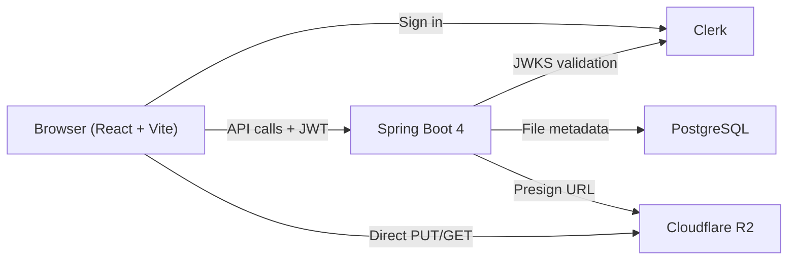

# pocket-drive

A personal cloud drive built to learn production object-storage patterns — presigned S3 uploads, Clerk JWT auth, and a React UI. File bytes never touch the backend.

[](https://github.com/dhev-sivakumar/pocket-drive/actions/workflows/ci.yml)

---

## Architecture



The backend is a metadata and authorization layer. All file transfers happen directly between the browser and Cloudflare R2 via short-lived presigned URLs.

---

## Stack

| Layer | Tech |
|-------|------|
| Backend | Spring Boot 4.0.5, Java 21, Maven |
| Auth | Clerk (JWT issuer) + Spring Security OAuth2 Resource Server |
| Database | PostgreSQL 16 (Testcontainers in tests) |
| Storage | Cloudflare R2 via AWS SDK v2 (`S3Client` + `S3Presigner`) |
| Frontend | React 18 + Vite + TypeScript |
| Styling | Tailwind CSS v4 + Catppuccin Latte/Mocha |

---

## Features

- **Presigned upload flow** — backend issues a short-lived PUT URL; browser streams directly to R2 with XHR progress tracking
- **Upload confirmation** — backend calls `HeadObject` to verify the object actually landed before marking it `UPLOADED`
- **Stale upload cleanup** — hourly job marks abandoned `PENDING` uploads as `FAILED` and deletes orphaned R2 objects
- **Ownership enforcement** — every operation checks `owner_id == jwt.sub`; no cross-user access
- **Catppuccin theme** — auto light/dark via `prefers-color-scheme` using CSS custom properties
- **Inline delete confirmation** — no browser `confirm()` dialogs; in-row Yes/Cancel flow
- **Request logging** — every API request logs method, path, status, and duration

---

## Running locally

### Prerequisites

- Java 21
- Docker (for PostgreSQL via Docker Compose)
- Node.js 22
- A [Clerk](https://clerk.com) dev application
- A [Cloudflare R2](https://developers.cloudflare.com/r2/) bucket with CORS configured (see `cors.json`)

### Backend

```bash
cp backend/.env.sample backend/.env
# fill in backend/.env with your R2 and Clerk values

cd backend
set -a && source .env && set +a
./mvnw spring-boot:run
# Docker Compose starts PostgreSQL automatically via spring-boot-docker-compose
```

### Frontend

```bash
# create frontend/.env.local
echo "VITE_CLERK_PUBLISHABLE_KEY=pk_test_..." > frontend/.env.local

cd frontend
npm install
npm run dev
```

Open `http://localhost:5173`.

### Tests

```bash
cd backend && ./mvnw test
# Testcontainers spins up a real PostgreSQL — no mocks, no H2
```

---

## Project layout

```
pocket-drive/
├── backend/          Spring Boot 4 — API, JPA, R2 integration, security
├── frontend/         React + Vite — upload UI, file list, Clerk auth
├── notes/            Design notes on patterns used in this project
├── cors.json         R2 bucket CORS rules (update AllowedOrigins for prod)
└── DESIGN.md         Architecture reference — data model, API, auth, upload flow
```

---

## Design notes

The `notes/` directory has standalone write-ups on the core patterns:

- [`file-upload-api-pattern.md`](notes/file-upload-api-pattern.md) — why presigned URLs instead of multipart through the backend
- [`presigned-url-crypto.md`](notes/presigned-url-crypto.md) — how HMAC signing works and what it guarantees
- [`s3client-vs-s3presigner.md`](notes/s3client-vs-s3presigner.md) — when to use each in the AWS SDK
