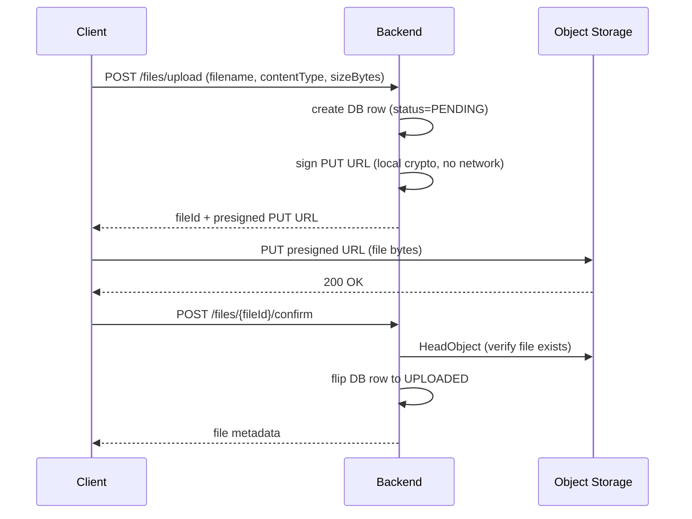
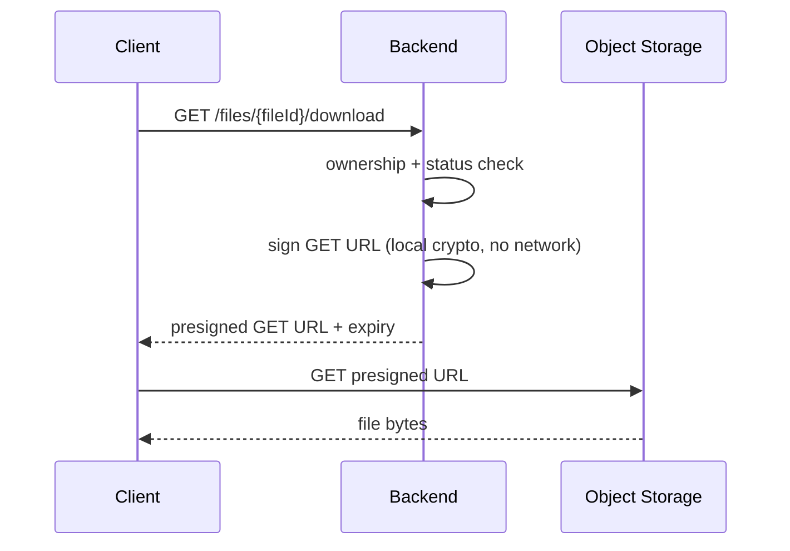

# File Upload API Pattern with Presigned URLs

A common pattern for file storage APIs where the backend orchestrates access but never proxies file bytes.

---

## Why not upload through the backend?

The naive approach — client POSTs the file to the backend, backend forwards it to object storage — works but has problems:

- The backend becomes a bandwidth bottleneck (every byte passes through it twice)
- Large uploads tie up server threads/connections for the full upload duration
- You pay egress costs on your compute layer in addition to storage costs

The presigned URL pattern eliminates this: the backend only handles metadata and auth. File bytes go directly between the client and object storage.

---

## Upload flow



### Why the confirm step?

The backend cannot know if the client actually completed the PUT to object storage — that request never touches the backend. The confirm call closes this gap:

- Client signals "I finished uploading"
- Backend verifies with a HeadObject (returns metadata, no bytes transferred)
- Only after verification does the file become visible in the system

Without confirm, a client could initiate an upload, never complete it, and the backend would have a PENDING row pointing to a nonexistent object forever.

---

## State machine

```
PENDING → UPLOADED → DELETED
```

| State | Meaning |
|---|---|
| PENDING | DB row created, upload not yet confirmed |
| UPLOADED | File verified in storage, visible to the owner |
| DELETED | Removed from storage, row retained for audit |

State transitions are strict — you cannot confirm a DELETED file, cannot download a PENDING file, etc. Any attempt returns a 409 Conflict.

The DB row is never hard-deleted. The object in storage is deleted; the metadata row stays. This gives you an audit trail and avoids ID reuse.

---

## Download flow

No bytes touch the backend. The client requests a presigned GET URL and downloads directly from storage.



The URL includes a `Content-Disposition: attachment` header baked into the signature, so the browser treats it as a download rather than navigation.

---

## Delete semantics

Two things happen on delete:

1. The object is removed from storage (synchronous, fast — no bytes transferred, server reclaims storage asynchronously)
2. The DB row is flipped to DELETED

If the storage delete fails (network error, object already gone), the row is marked DELETED anyway. The failure is logged but not surfaced to the caller. Rationale: the client's intent was to delete — a partially-failed delete that leaves the object invisible to the API is an acceptable outcome.

---

## Expiry

Presigned URLs are time-limited. After expiry, storage rejects the request even if the signature is otherwise valid.

- Upload URLs: short window (e.g. 15 minutes) — the upload either happens promptly or the user re-initiates
- Download URLs: longer window (e.g. 1 hour) — enough for the client to start streaming

The expiry is baked into the HMAC signature. Tampering with the timestamp in the URL invalidates the signature.

---

## Error responses

All errors return a consistent shape:

```json
{
  "error": "FILE_NOT_FOUND",
  "message": "File not found: <uuid>",
  "timestamp": "2026-04-19T10:00:00Z"
}
```

| HTTP status | When |
|---|---|
| 400 Bad Request | Validation failure (missing field, unsupported content type, file too large) |
| 404 Not Found | File ID does not exist or belongs to a different owner |
| 409 Conflict | State machine violation (e.g. confirming an already-deleted file) |
| 500 Internal Server Error | Unhandled exception |
