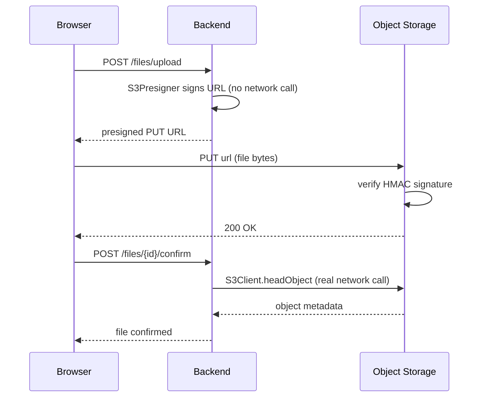

# S3Client vs S3Presigner

R2 is S3-compatible. The AWS SDK v2 works against it by pointing the endpoint at Cloudflare instead of `amazonaws.com`. The SDK exposes two distinct classes for two distinct concerns.

---

## S3Client

General-purpose client. Every call makes a **real network request** from the backend to the storage service.

Common operations:

| Method | What it does |
|---|---|
| `HeadObject` | Check if an object exists — returns metadata, no body |
| `DeleteObject` | Tell the storage service to remove a key — synchronous but fast regardless of file size because no bytes are transferred; the server acknowledges immediately and reclaims storage asynchronously on its side |
| `PutObject` | Upload an object directly from the server |
| `GetObject` | Download an object directly to the server |

Think of it as an HTTP client that already knows the S3 API shape, handles auth headers, retries, etc.

---

## S3Presigner

Does **no network I/O**. It only does cryptographic math.

Takes a request you *would* make (e.g. "PUT this object with this content type and size") and uses credentials to compute an HMAC-SHA256 signature over it. Then bakes the signature, access key ID, expiry timestamp, and request parameters into a single self-contained URL:

```
https://bucket.account.r2.cloudflarestorage.com/key
  ?X-Amz-Algorithm=AWS4-HMAC-SHA256
  &X-Amz-Credential=<access-key-id>/...
  &X-Amz-Expires=900
  &X-Amz-Signature=bc945f7d...
```

When a client sends this URL to R2, R2 recomputes the same HMAC using its copy of the secret key and checks it matches. If it does — authorized. If expired or tampered with — rejected.

The secret key never leaves the backend. The client holds a time-limited proof that the backend pre-authorized this exact operation.

---

## Why two separate classes?



`S3Presigner` — handing off work to the client. Pure local computation, no latency, no network call.

`S3Client` — backend needs to verify or mutate state in storage directly. Real network calls.

They're separate because the concerns are fundamentally different: one is crypto, one is I/O.

---

## How to verify presigned URL generation

1. Call `presignUpload` and print the resulting URL
2. PUT a file directly to that URL via curl:
   ```bash
   curl -X PUT -H "Content-Type: text/plain" -d "hello world!" "<presigned-url>"
   ```
   Expect HTTP 200.
3. Verify the object landed in the bucket:
   ```bash
   wrangler r2 object get <bucket>/<key> --pipe --remote
   ```
4. Clean up:
   ```bash
   wrangler r2 object delete <bucket>/<key> --remote
   ```
